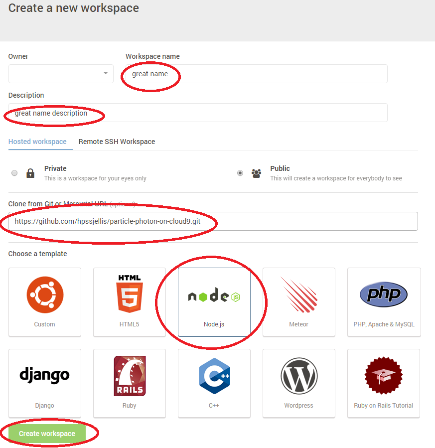

# particle-photon-on-cloud9
particle-photon-on-cloud9

and a really easy example of using webhooks

photon-json.ino should be flashed to the Particle photon

myhook3.json should be uploaded to particle using the CLI installed on your computer or a virtual client described below

the command to upload myhook3.json is 

particle webhook create myhook3.json

To make a virtual particle CLI follow these steps:

use http://c9.io

login and make a new workspace.

Click Node.js and then enter the github repository

https://github.com/hpssjellis/particle-photon-on-cloud9.git

click create workspace and wait a few seconds

In the lower box terminal enter the command (and wait about 5 minutes)

npm install

then npm start

or just type

particle login

in that terminal you can then type the other particle commands such as

particle help

particle webhook creat myhook3.json      (creates a webhook)

particle webhook list      (lists your webhooks and the webhook number)

particle webhook delete           (needs the webhook number)

particle list         (lists your devices)

particle subscribe mine    (shows the traffic to and from your device)

